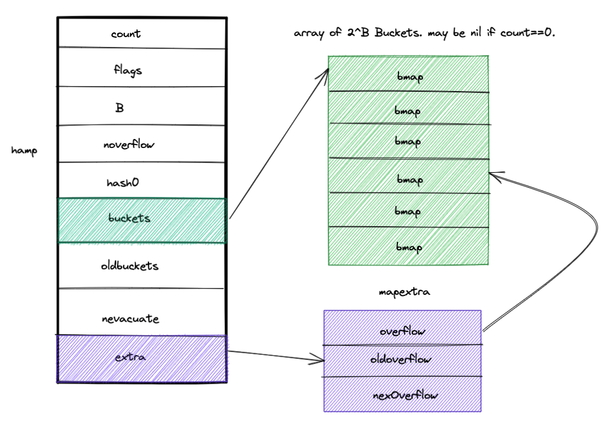

# go map
go map 源码解析

map 其实是一种哈希表的数据结构，大多数语言都会内置数组和哈希表两种数据结构。

哈希表的出现就是为了解决数组中无法通过key快速定位到value的问题，哈希表提供了接近于O(1)的时间复杂度来解决这样的问题。

## 哈希函数

哈希表实现O(1)的时间复杂度的原理是什么？

基于哈希函数将 key 的位置提前确定，每次查找当前 key，仅需通过 key 即可找到 key 对应的位置，不用对整个集合全局遍历。

理想情况下，我们希望哈希函数生成的 hashkey 都不同，但是正常情况下，哈希函数是不一定完美的，当输入的键足够多会产生冲突，所以会存在发生哈希碰撞的可能，这时就需要一些方法来解决哈希碰撞的问题，常见方法的有：开放寻址法和拉链式。

### 开放寻址法

是一种在哈希表中解决哈希碰撞的比较普通的方法，这种方法的核心思想是：**依次探测和比较数组中的元素以判断目标键值对是否存在于哈希表中**
，如果我们使用开放寻址法来实现哈希表，那么实现哈希表底层的数据结构就是数组，不过因为数组的长度有限。

开放寻址法中对性能影响最大的是**装载因子**，它是数组中元素的数量与数组大小的比值。随着装载因子的增加，线性探测的平均用时就会逐渐增加，这会影响哈希表的读写性能。当装载率超过 70% 之后，哈希表的性能就会急剧下降，而一旦装载率达到 100%，整个哈希表就会完全失效，这时查找和插入任意元素的时间复杂度都是 𝑂(𝑛) 的，这时需要遍历数组中的全部元素，所以在实现哈希表时一定要关注装载因子的变化。

### 拉链式

实现拉链法一般会使用数组加上链表，不过一些编程语言会在拉链法的哈希中引入红黑树以优化性能，拉链法会使用链表数组作为哈希底层的数据结构，我们可以将它看成可以扩展的二维数组：

如上图所示，当我们需要将一个键值对 (Key6, Value6) 写入哈希表时，键值对中的键 Key6 都会先经过一个哈希函数，哈希函数返回的哈希会帮助我们选择一个桶，和开放地址法一样，选择桶的方式是直接对哈希返回的结果取模：

index := hash("Key6") % array.len

选择了 2 号桶后就可以遍历当前桶中的链表了，在遍历链表的过程中会遇到以下两种情况：

1. 找到键相同的键值对 — 更新键对应的值；
2. 没有找到键相同的键值对 — 在链表的末尾追加新的键值对；

## go 语言的map实现原理

首先，go map 的数据结构如下：
```go
// A header for a Go map.
type hmap struct {
	// Note: the format of the hmap is also encoded in cmd/compile/internal/reflectdata/reflect.go.
	// Make sure this stays in sync with the compiler's definition.
	count     int // # live cells == size of map.  Must be first (used by len() builtin)
	flags     uint8
	B         uint8  // log_2 of # of buckets (can hold up to loadFactor * 2^B items)
	noverflow uint16 // approximate number of overflow buckets; see incrnoverflow for details
	hash0     uint32 // hash seed
	buckets    unsafe.Pointer // array of 2^B Buckets. may be nil if count==0.
	oldbuckets unsafe.Pointer // previous bucket array of half the size, non-nil only when growing
	nevacuate  uintptr        // progress counter for evacuation (buckets less than this have been evacuated)

	extra *mapextra // optional fields
}

// mapextra holds fields that are not present on all maps.
type mapextra struct {
	// If both key and elem do not contain pointers and are inline, then we mark bucket
	// type as containing no pointers. This avoids scanning such maps.
	// However, bmap.overflow is a pointer. In order to keep overflow buckets
	// alive, we store pointers to all overflow buckets in hmap.extra.overflow and hmap.extra.oldoverflow.
	// overflow and oldoverflow are only used if key and elem do not contain pointers.
	// overflow contains overflow buckets for hmap.buckets.
	// oldoverflow contains overflow buckets for hmap.oldbuckets.
	// The indirection allows to store a pointer to the slice in hiter.
	overflow    *[]*bmap
	oldoverflow *[]*bmap

	// nextOverflow holds a pointer to a free overflow bucket.
	nextOverflow *bmap
}
```
我将其抽象为如下图所示：


其中，count 为当前哈希表的元素数量

B为当前哈希表拥有的bucket的数量

hash0为哈希的种子，他能为哈希函数的结果引入随机性，这个值在创建哈希表时就确定了，并在调用哈希函数时作为参数传入。

oldbuckets 是哈希在扩容时用于保存之前的buckets的字段，它的大小是当前buckets的一半。

如上图所示哈希表 `runtime.hmap` 的桶是 `runtime.bmap`。每一个 `runtime.bmap` 都能存储 8 个键值对，当哈希表中存储的数据过多，单个桶已经装满时就会使用 `extra.nextOverflow` 中桶存储溢出的数据。

上述两种不同的桶在内存中是连续存储的，我们在这里将它们分别称为正常桶和溢出桶，上图中黄色的 `runtime.bmap` 就是正常桶，绿色的 `runtime.bmap` 是溢出桶。


## map 的读写原理剖析
先看看 map 的读写流程：
makemap

源码解析如下：
```
```

## map 的扩容

## 总结