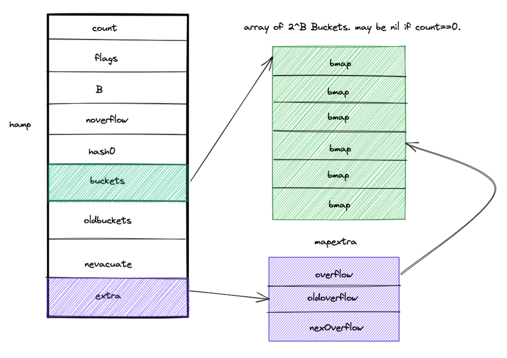

# 「go」map delete 操作后会被 gc 回收吗？

如题，go 语言的 map 执行 delete 操作后会被 GC 回收吗？

先看一段程序

```go
package main

import (
	"fmt"
	"math/rand"
	"runtime"
)

type Person struct {
	ID   int64
	Name string
}

var m map[int]Person = make(map[int]Person, 10000)

func main() {
	traceMemStats()
	for i := 0; i < 10000; i++ {
		p := Person{
			ID:   rand.Int63n(1000000000),
			Name: "hello world",
		}
		m[i] = p

	}
	runtime.GC()
	traceMemStats()
	for k, _ := range m {
		delete(m, k)
	}
	runtime.GC()
	traceMemStats()
	m = nil
	runtime.GC()
	traceMemStats()
}

func traceMemStats() {
	var m runtime.MemStats
	runtime.ReadMemStats(&m)
	fmt.Printf("分配的内存 = %vKB, GC的次数 = %v\n", m.Alloc/1024, m.NumGC)
}

```

输出结果如下：

```bash
分配的内存 = 703KB, GC的次数 = 0
分配的内存 = 697KB, GC的次数 = 1
分配的内存 = 699KB, GC的次数 = 2
分配的内存 = 115KB, GC的次数 = 3
```

delete前后，即使强制gc，内存占用竟然几乎没有变化？

why？

delete 之后，map竟然没有将空闲的空间释放掉？

## go map delete 源码追踪

我们可以用 dlv 或者 gdb 等调试工具，一步步追源码，查看 delete 源码具体底层是如何调用的。

但是由于调用链过于复杂，我追了几步之后，嫌麻烦，没有跟下去了，我用了一种新的方法来追踪到底层源码的最终调用函数。因为 Go 语言是一个编译型语言，我们写的代码会编译成汇编语言。

在 Go 汇编语言中 CALL 指令是用于调用函数的，RET 指令用于从调用函数返回。因为我们可以利用 Go 语言的这种的汇编语法特性，来找到 map 执行 delete 调用的函数

 使用
 `go tool compile -S -N -l testmap.go | grep "CALL"`

查看上述代码的汇编输出结果如下：

```go     
0x0026 00038 (main.go:17)       CALL    "".traceMemStats(SB)
0x004c 00076 (main.go:20)       CALL    math/rand.Int63n(SB)
0x0097 00151 (main.go:23)       CALL    runtime.mapassign_fast64(SB)
0x00ce 00206 (main.go:23)       CALL    runtime.gcWriteBarrierCX(SB)
0x00e9 00233 (main.go:26)       CALL    runtime.GC(SB)
0x00ee 00238 (main.go:27)       CALL    "".traceMemStats(SB)
0x012c 00300 (main.go:28)       CALL    runtime.mapiterinit(SB)
0x015a 00346 (main.go:29)       CALL    runtime.mapdelete_fast64(SB)
0x0167 00359 (main.go:28)       CALL    runtime.mapiternext(SB)
0x016e 00366 (main.go:31)       CALL    runtime.GC(SB)
0x0173 00371 (main.go:32)       CALL    "".traceMemStats(SB)
0x019a 00410 (main.go:33)       CALL    runtime.gcWriteBarrier(SB)
0x01a2 00418 (main.go:34)       CALL    runtime.GC(SB)
0x01a7 00423 (main.go:35)       CALL    "".traceMemStats(SB)
0x01c0 00448 (main.go:16)       CALL    runtime.morestack_noctxt(SB)
0x0045 00069 (main.go:40)       CALL    runtime.ReadMemStats(SB)
...
省略以下不重要的输出
...
```

其中需要关注的就是 main.go 第 29 行对应的代码：

```go
0x015a 00346 (main.go:29)       CALL    runtime.mapdelete_fast64(SB)
```

最终调用的是 runtime.mapdelete_fast64，该函数和 runtime.mapdelete 等价。

## go map 数据结构

关于map的数据结构如下：
```go
// A header for a Go map.
type hmap struct {
	// Note: the format of the hmap is also encoded in cmd/compile/internal/reflectdata/reflect.go.
	// Make sure this stays in sync with the compiler's definition.
	count     int // # live cells == size of map.  Must be first (used by len() builtin)
	flags     uint8
	B         uint8  // log_2 of # of buckets (can hold up to loadFactor * 2^B items)
	noverflow uint16 // approximate number of overflow buckets; see incrnoverflow for details
	hash0     uint32 // hash seed

	buckets    unsafe.Pointer // array of 2^B Buckets. may be nil if count==0.
	oldbuckets unsafe.Pointer // previous bucket array of half the size, non-nil only when growing
	nevacuate  uintptr        // progress counter for evacuation (buckets less than this have been evacuated)

	extra *mapextra // optional fields
}

// mapextra holds fields that are not present on all maps.
type mapextra struct {
	// If both key and elem do not contain pointers and are inline, then we mark bucket
	// type as containing no pointers. This avoids scanning such maps.
	// However, bmap.overflow is a pointer. In order to keep overflow buckets
	// alive, we store pointers to all overflow buckets in hmap.extra.overflow and hmap.extra.oldoverflow.
	// overflow and oldoverflow are only used if key and elem do not contain pointers.
	// overflow contains overflow buckets for hmap.buckets.
	// oldoverflow contains overflow buckets for hmap.oldbuckets.
	// The indirection allows to store a pointer to the slice in hiter.
	overflow    *[]*bmap
	oldoverflow *[]*bmap

	// nextOverflow holds a pointer to a free overflow bucket.
	nextOverflow *bmap
}
```
关于 go map 的具体源码实现，这里就不展开了，下一篇文章会讲到。
其大概的数据结构，如下图所示

简单来说，就是 go map 的数据结构由 hmap 构成，hamp 包含多个buckets，key valaue 就存在 buckets 中，如果 hash 函数计算出来的 key 有冲突，则将其存储到 overflow 中。 

因为，后面执行 delete 操作时，可能会涉及到 buckets 和 overflow 两个数据结构。

## delete 源码剖析

源码比较长，先简单介绍下 mapdlete 的删除流程：


其中

```go
func mapdelete(t *maptype, h *hmap, key unsafe.Pointer) {
	//是否有竞争等判断
	if raceenabled && h != nil {
		callerpc := getcallerpc()
		pc := abi.FuncPCABIInternal(mapdelete)
		racewritepc(unsafe.Pointer(h), callerpc, pc)
		raceReadObjectPC(t.key, key, callerpc, pc)
	}
	if msanenabled && h != nil {
		msanread(key, t.key.size)
	}
	if asanenabled && h != nil {
		asanread(key, t.key.size)
	}
	//map是否为空判断
	if h == nil || h.count == 0 {
		if t.hashMightPanic() {
			t.hasher(key, 0) // see issue 23734
		}
		return
	}
	//写保护检测
	if h.flags&hashWriting != 0 {
		throw("concurrent map writes") //并发操作直接抛错
	}
	//计算key的哈希值
	hash := t.hasher(key, uintptr(h.hash0))

	// Set hashWriting after calling t.hasher, since t.hasher may panic,
	// in which case we have not actually done a write (delete).

	//执行写保护
	h.flags ^= hashWriting
	//寻找对应的桶编号
	bucket := hash & bucketMask(h.B)
	//判断是否在扩容阶段，在的话，就直接先扩容一次
	if h.growing() { 
		growWork(t, h, bucket)
	}
  //确定该key对应在hashmap中的bmap结构数据
	b := (*bmap)(add(h.buckets, bucket*uintptr(t.bucketsize)))
	//记录最开始指向的bmp结构
	bOrig := b
	//取hmap中缓存的hash值高八位数据，下一篇文章会具体介绍到
	top := tophash(hash)
/**
以下内容就是在桶中查找数据，先在bucket中查找对应的key，如果没有找到就在overflow中查找key
找到key之后，直接将结果置空
**/
search:
	//判断b是否为空，不为空，则在当前bucket中查找key，如果没有找到则在overflow桶中查找
	for ; b != nil; b = b.overflow(t) {
		for i := uintptr(0); i < bucketCnt; i++ {
			if b.tophash[i] != top {
				if b.tophash[i] == emptyRest { //如果后面都是空闲区域，则直接退出寻找，因为后面不可能有数据了
					break search 
				}
				continue
			}
			k := add(unsafe.Pointer(b), dataOffset+i*uintptr(t.keysize))
			k2 := k
			if t.indirectkey() {
				k2 = *((*unsafe.Pointer)(k2))
			}
			//如果key不想等，继续查找key
			if !t.key.equal(key, k2) {
				continue
			}
			// Only clear key if there are pointers in it.
			//key如果是指针，则清除该指针
			if t.indirectkey() {
				*(*unsafe.Pointer)(k) = nil
			} else if t.key.ptrdata != 0 {
				memclrHasPointers(k, t.key.size)
			}
			//获取value
			e := add(unsafe.Pointer(b), dataOffset+bucketCnt*uintptr(t.keysize)+i*uintptr(t.elemsize))
			if t.indirectelem() {
				*(*unsafe.Pointer)(e) = nil
			} else if t.elem.ptrdata != 0 {
				memclrHasPointers(e, t.elem.size)
			} else {
				memclrNoHeapPointers(e, t.elem.size)
			}
				//查找到key了，则将其值变为emptyOne
			b.tophash[i] = emptyOne
			// If the bucket now ends in a bunch of emptyOne states,
			// change those to emptyRest states.
			// It would be nice to make this a separate function, but
			// for loops are not currently inlineable.
			//如果tophash[i]后面位置也为emptyRest的话，说明后面都是空闲的K/V，当前tophash也应更新为emptyRest
			if i == bucketCnt-1 {
				if b.overflow(t) != nil && b.overflow(t).tophash[0] != emptyRest {
					goto notLast
				}
			} else {
				if b.tophash[i+1] != emptyRest {
					goto notLast
				}
			}
		//剩下就是收尾操作，将tophash[i]后面都置为emptyRest，
			for {
				b.tophash[i] = emptyRest //for循环中把前面所有连续的emptyOne置为emptyRest
				if i == 0 {
					if b == bOrig { //此时b可能是溢出桶，需要往前遍历
						break // beginning of initial bucket, we're done. //找到初始bmp的头了，结束循环
					}
					// Find previous bucket, continue at its last entry.
					//此时的b为溢出桶，下面for循环找到b前面的一个溢出桶
					c := b
					for b = bOrig; b.overflow(t) != c; b = b.overflow(t) {
					}
					//更新i为最后的尾部位置
					i = bucketCnt - 1
				} else {
					i--
				}
				//可能有Key/Value的值是emptyRest，不用处理，直接退出
				if b.tophash[i] != emptyOne {
					break
				}
			}
		//最后将hash的数量也减一
		notLast:
			h.count--
			// Reset the hash seed to make it more difficult for attackers to
			// repeatedly trigger hash collisions. See issue 25237.
			if h.count == 0 {
				h.hash0 = fastrand()
			}
			break search
		}
	}

	if h.flags&hashWriting == 0 {
		throw("concurrent map writes")
	}
	//解除写保护
	h.flags &^= hashWriting
}
```

## 总结
Go 语言的 map 的 delete 函数，并不会释放原先使用的内存空间，如果持续增加很多 map 的 key value 数据，不释放的话，确实是会造成 OOM 的。


只有当该 map 置为 nil 之后，该 map 的空间才会释放，但是这种做法一般是不用当前 map 才使用的。


目前可以解决该问题的处理方法为：
1. 重建 map， 用新的 map 来接收原 map 的数据，并释放掉原 map
2. 直接使用 go-zero 提供的 safemap 

注： 本文代码基于Go1.18版本
全文首发于「阿星的云原生之路」


欢迎关注，一起学习探讨 Go 语言！